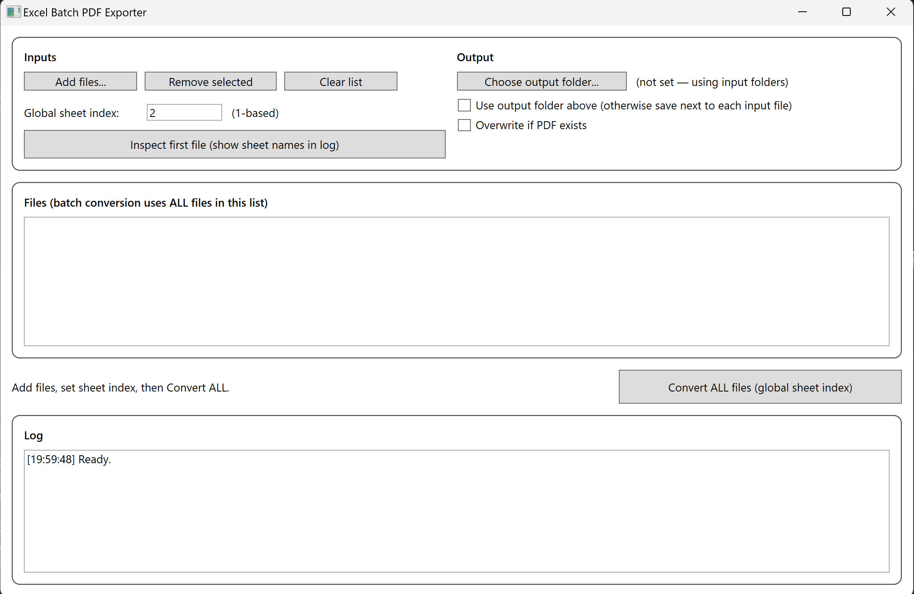
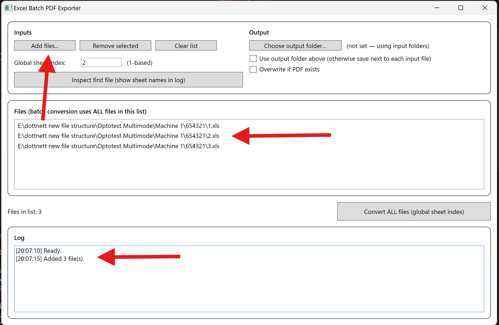
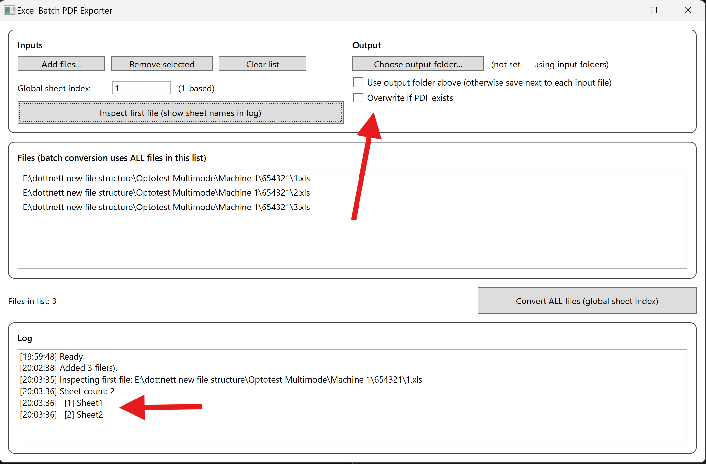
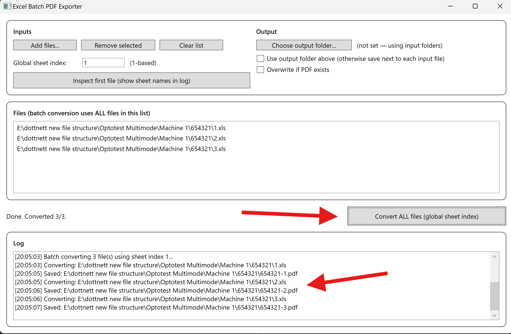
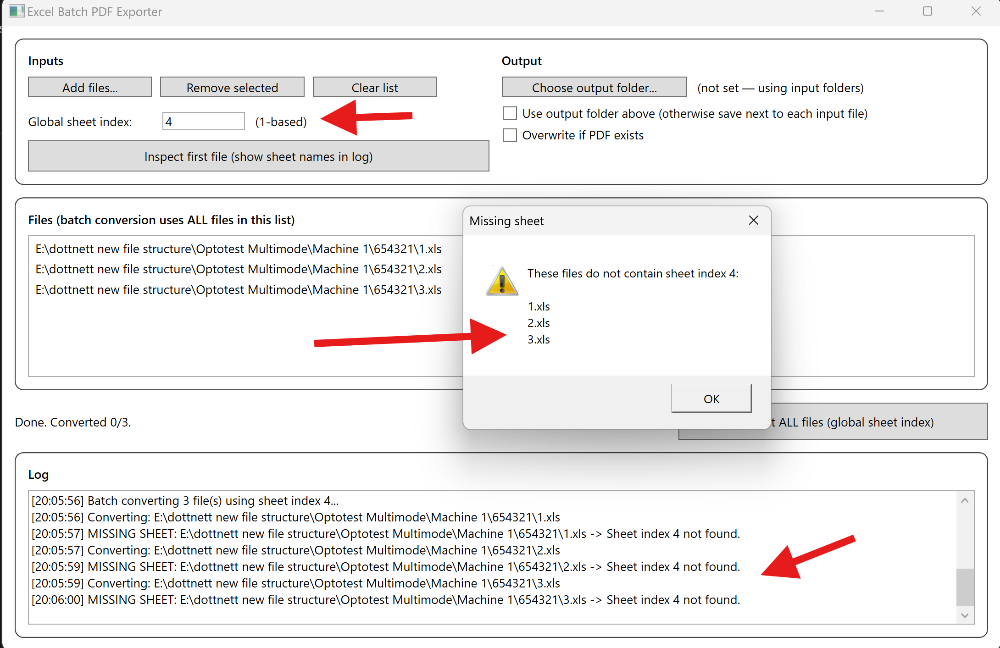

# ExcelBatchPdfExporter

A Windows desktop application for batch converting Excel files to PDF using Excel’s native Print-to-PDF functionality.

The application is built with .NET 8 (WPF) and uses late-bound Excel COM automation to avoid Office Interop version issues while maintaining perfect layout fidelity.

---

## Features

- Batch convert multiple Excel files in one operation
- Global configuration to export a specific worksheet index across all files
- Automatic validation and warning for files missing the selected sheet
- Save PDFs next to input files or in a single chosen output folder
- Deterministic output naming:
  example: 
  exceldocs-1.pdf

- Optional overwrite protection
- Uses Excel’s native `ExportAsFixedFormat` PDF engine

---

## Screenshots

This section shows the application workflow from start to finish.

### Main application window
Shows the application immediately after launch.



---

### Adding Excel files for batch processing
Demonstrates adding multiple Excel files to the batch list.



---

### Output folder and global sheet configuration
Shows selection of an output folder and configuration of the global sheet index.



---

### Ready to convert all files
Illustrates the application fully configured and ready to start batch conversion.



---

### Missing sheet warning
Example warning shown when one or more files do not contain the selected sheet.



---

## Requirements

- Windows
- Microsoft Excel installed
- .NET 8 SDK

Excel must be installed on the machine running the application, as the tool automates Excel directly.

---

## How to Run

From the repository root, run:

```powershell
dotnet run --project src\ExcelBatchPdfExporter.Gui

