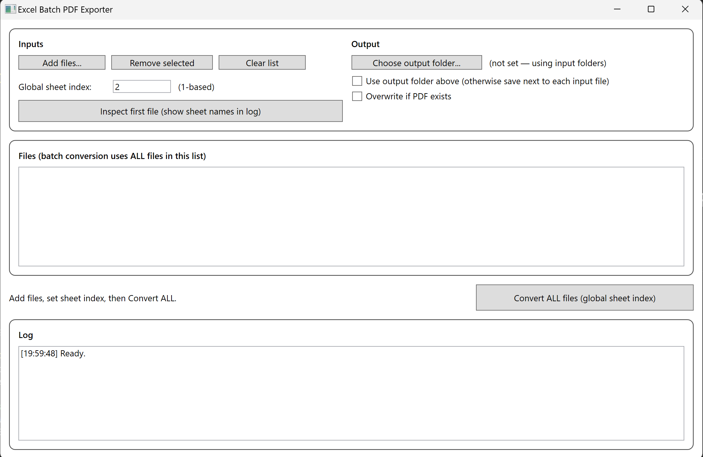
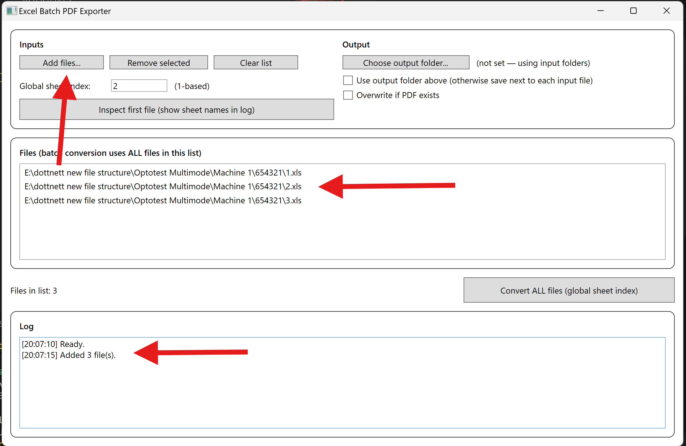
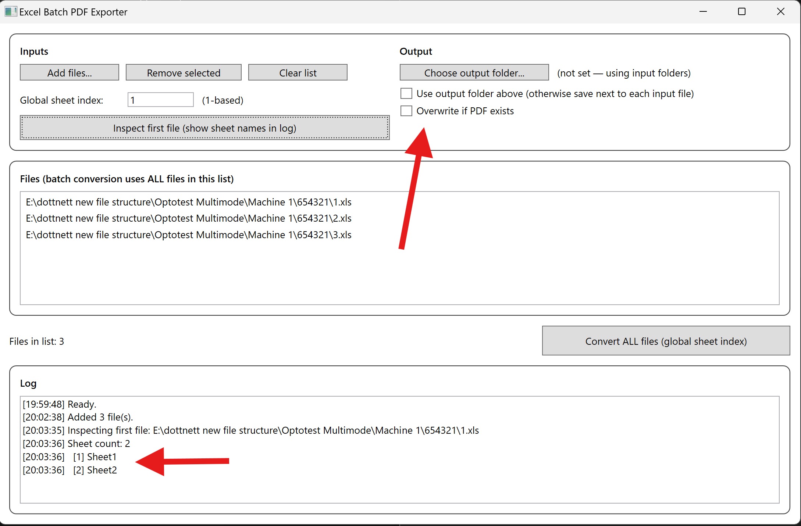
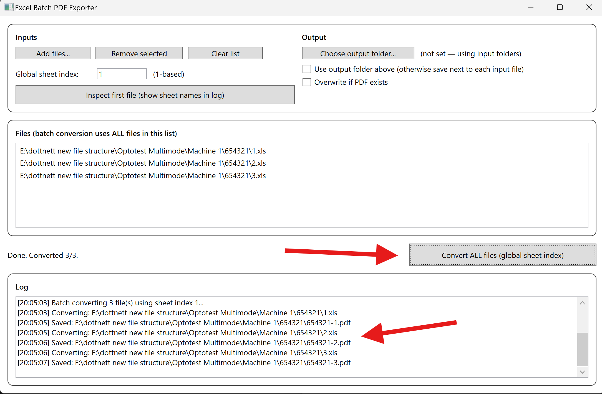
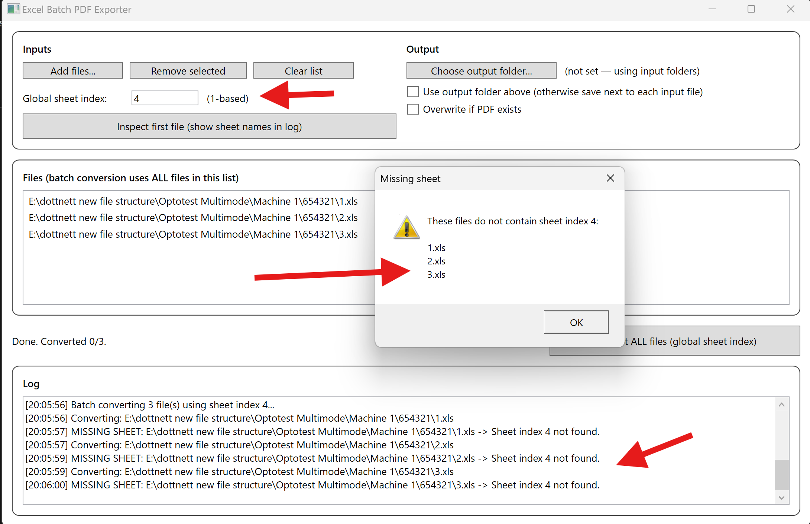

# ExcelBatchPdfExporter

A Windows desktop application for batch converting Excel files to PDF using Excel’s native Print-to-PDF functionality.

---

## What This Project Does 🎯
ExcelBatchPdfExporter is a Windows desktop application that allows users to batch convert multiple Excel workbooks to PDF format using Excel's built-in `ExportAsFixedFormat` feature. The application is designed with a WPF GUI and leverages late-bound Excel COM automation for layout fidelity.

## Tech Stack 🛠️
| Technology      | Description                          |
|-----------------|--------------------------------------|
| C#              | Primary programming language         |
| .NET 8         | Framework used for development       |
| WPF             | GUI framework used                   |
| Excel COM       | Used for automation and exporting    |

## Features ✨
- Batch convert multiple Excel files in one operation
- Global configuration to export a specific worksheet index across all files
- Automatic validation and warning for files missing the selected sheet
- Save PDFs next to input files or in a single chosen output folder
- Deterministic output naming: example: exceldocs-1.pdf
- Optional overwrite protection
- Uses Excel’s native `ExportAsFixedFormat` PDF engine

## Getting Started 🚀
### Prerequisites
- Windows
- Microsoft Excel installed
- .NET 8 SDK

### How to Run
From the repository root, run:
```powershell
dotnet run --project src\ExcelBatchPdfExporter.Gui
```

## What Changed In This Update 📝
Recent updates include a revision of the README for improved project documentation, with additional details, features, and screenshots added to enhance project information. The README was auto-generated via the DevOps Portfolio Analyzer.

## Architecture 📊
```
+-----------------------------------+
|          ExcelBatchPdfExporter     |
|                                   |
|  +-------------------------------+  |
|  |          WPF GUI             |  |
|  +-------------------------------+  |
|                                   |
|  +-------------------------------+  |
|  |   Excel COM Automation       |  |
|  +-------------------------------+  |
|                                   |
+-----------------------------------+
```

## Screenshots 🖼️
### Main application window
Shows the application immediately after launch.


### Adding Excel files for batch processing
Demonstrates adding multiple Excel files to the batch list.


### Output folder and global sheet configuration
Shows selection of an output folder and configuration of the global sheet index.


### Ready to convert all files
Illustrates the application fully configured and ready to start batch conversion.


### Missing sheet warning
Example warning shown when one or more files do not contain the selected sheet.


## Contributing 🤝
Contributions are welcome! Please feel free to submit a pull request or open an issue to discuss improvements.

## License 📄
This project is licensed under the MIT License.